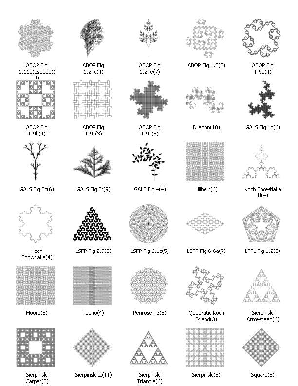
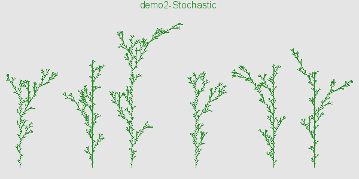
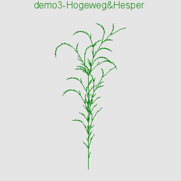

# lsystems examples

A tour of the example files included with this package.

## demo1.go
Deterministic rules with PNG and HP-GL/2 plot outputs.
```go
/*Dragon curve of order 10*/
package main
import (
    "fmt"
    "github.com/ybeaudoin/go-lsystems"
    "strings"
)
func main() {
    order       := 10
    angle       := 90.
    axiom       := "$FX"
    rules       := strings.NewReplacer("X", "X-YF-", "Y", "+FX+Y")
    /*Plot parameters*/
    penWidth    := 0.35 //mm
    plotTitle   := "demo1-Dragon(10)"
    plotWidth   := 300 //pixels
    plotHeight  := 300 //pixels
    lineWidth   := 1
    lineColor   := "red"
    bgColor     := lsystems.EncodeBgColorName("gray70") //i.e., "xb3b3b3"
    pngFile     := plotTitle + ".png"
    pltFile     := plotTitle + ".plt"
    terminalCmd := fmt.Sprintf("set terminal png lw %d size %d,%d %s",
                               lineWidth, plotWidth, plotHeight, bgColor)
    outputCmd   := fmt.Sprintf(`set output "%s"`, pngFile)
    /*Generate turtle commands*/
    lsystems.Deterministic(order, axiom, rules)
    //fmt.Println(lsystems.TurtleCmds) //to see the turtle commands
    /*Output PNG file*/
    lsystems.Plot(angle, terminalCmd, outputCmd, plotTitle, lineColor)
    //lsystems.Plot(angle, terminalCmd, outputCmd, plotTitle, lineColor, "gnuplot.cmds") //to capture the gnuplot commands
    fmt.Println("output written to " + pngFile)
    /*Output HP-GL/2 file*/
    lsystems.HpglPlot(angle, plotTitle, penWidth, pltFile)
    fmt.Println("output written to " + pltFile)
}
```
.png)

## examples1.go

A more elaborate demonstration which processes 30 deterministic context-free examples. Users can select from various
plot formats, namely, GIF, JPEG, PNG, SVG and HP-GL/2. Here's a black-on-white contact sheet showing the L-systems in question:



## demo2.go
6 consecutive runs of a set of stochastic "plant-growth" rules with PNG and HP-GL/2 multi-plot outputs.
```go
/*Stochastic context-free rules: see http://algorithmicbotany.org/papers/abop/abop.pdf, Section 1.7*/
package main
import (
    "fmt"
    "github.com/ybeaudoin/go-lsystems"
)
func main() {
    order       := 5
    angle       := 25.7
    axiom       := "$F"
    rules       := []string{ "F[+F]F[-F]F", "F[+F]F", "F[-F]F" }
    weights     := []int{ 3, 4, 4 } //probability of a rule being chosen: 100%*3/11, 100%*4/11 & 100%*4/11 respectively
    numPlants   := 6
    /*Plot parameters*/
    penWidth    := 0.35 //mm
    plotTitle   := "demo2-Stochastic"
    plotWidth   := 600 //pixels
    plotHeight  := 300 //pixels
    lineWidth   := 1
    lineColor   := "forest-green"
    bgColor     := lsystems.EncodeBgColorName("gray90")
    pngFile     := plotTitle + ".png"
    pltFile     := plotTitle + ".plt"
    terminalCmd := fmt.Sprintf("set terminal png lw %d size %d,%d %s",
                               lineWidth, plotWidth, plotHeight, bgColor)
    outputCmd   := fmt.Sprintf(`set output "%s"`, pngFile)
    /*Generate & save the turtle commands*/
    labels       := make([]string, numPlants)
    turtleCmds   := make([]string, numPlants)
    turtleAngles := make([]float64, numPlants)
    for run := 0; run < numPlants; run++ {
        lsystems.Stochastic(order, axiom, rules, weights)
        turtleCmds[run]   = lsystems.TurtleCmds
        turtleAngles[run] = angle
    }
    /*Output PNG file*/
    lsystems.MultiPlot(turtleCmds, turtleAngles, terminalCmd, outputCmd, plotTitle, labels, lineColor)
    fmt.Println("output written to " + pngFile)
    /*Output HP-GL/2 file*/
    lsystems.HpglMultiPlot(turtleCmds, turtleAngles, plotTitle, labels, penWidth, pltFile)
    fmt.Println("output written to " + pltFile)
}
```


## examples2.go

A slightly more elaborate version of **demo2.go** with different weights and optional multi-plot formats.

## demo3.go
Hogeweg and Hesper rules with PNG output:
```go
/*Hogeweg and Hesper context rules: see http://algorithmicbotany.org/papers/abop/abop.pdf*/
package main
import (
    "fmt"
    "github.com/ybeaudoin/go-lsystems"
)
func main() {
    order       := 30
    angle       := 15.
    axiom       := "$F1F1F1"
    rules       := map[string]string{
                    "0 < 0 > 0" : "1",
                    "0 < 0 > 1" : "1[-F1F1]",
                    "0 < 1 > 0" : "1",
                    "0 < 1 > 1" : "1",
                    "1 < 0 > 0" : "0",
                    "1 < 0 > 1" : "1F1",
                    "1 < 1 > 0" : "1",
                    "1 < 1 > 1" : "0" }
    /*Plot parameters*/
    plotTitle   := "demo3-Hogeweg&Hesper"
    plotWidth   := 300 //pixels
    plotHeight  := 300 //pixels
    lineWidth   := 1
    lineColor   := "forest-green"
    bgColor     := lsystems.EncodeBgColorName("gray90")
    pngFile     := plotTitle + ".png"
    terminalCmd := fmt.Sprintf("set terminal png lw %d size %d,%d %s",
                               lineWidth, plotWidth, plotHeight, bgColor)
    outputCmd   := fmt.Sprintf(`set output "%s"`, pngFile)
    /*Generate turtle commands*/
    lsystems.HogewegHesper(order, axiom, rules)
    /*Output PNG file*/
    lsystems.Plot(angle, terminalCmd, outputCmd, plotTitle, lineColor)
    fmt.Println("output written to " + pngFile)
}
```


## examples3.go
5 sets of Hogeweg and Hesper rules with multi-plot output illustrating the wide variability of the results.


